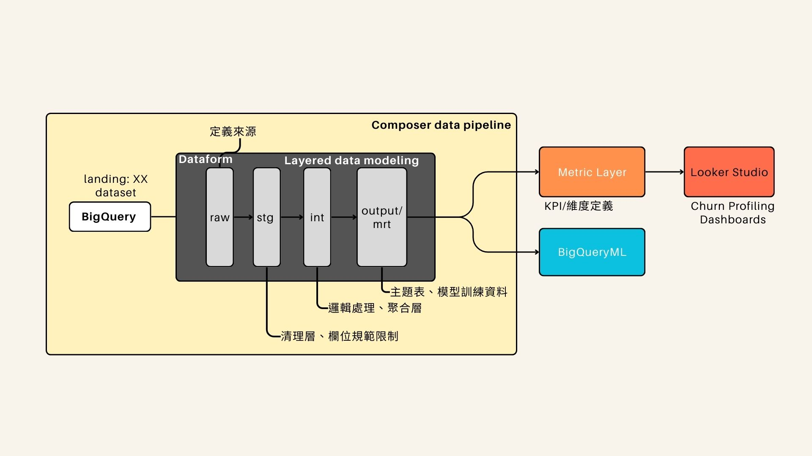
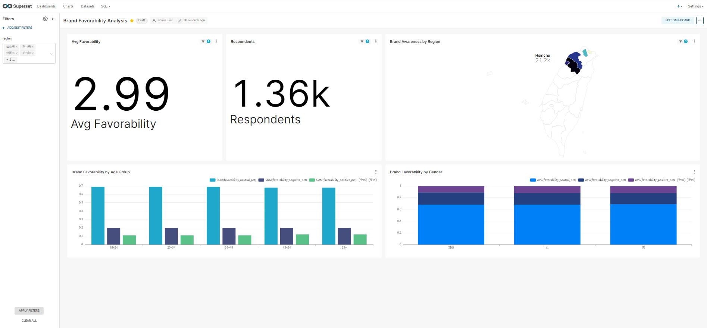

# DESP03

## Overview

本專案在GCP數據平台上進行電商數據分析實作，針對會員分析問題，

使用GCP平台的theLook eCommence做為資料，對組合商品的購買行為進行分析，來提供行銷團隊決策參考，評估組合商品

1. 明星組合商品(選擇其中的一個高單價商品作為組合商品)較A、B商品單買是否能提升買氣? 客單價、回購率
2. 是否較易吸引新會員購買? 分群分析

--- 

## Objectives

- 洞察與行銷策略建議
- 以ELT架構將常態分析的數據模型建立起自動化數據管線
- BI Dashboard設計作為週期評估的工具

---

## Technical Stack

| 工具 | 用途 |
|------|------|
| **SQL** | 資料清洗與貼標 |
| **BigQuery** | 雲端資料儲存與查詢 |
| **Dataform** | 資料建模與轉換(SQL-Based) |
| **Composer** | 工作流程排程 |
| **Looker Studio** | BI工具 |
| **Gmail** | 排程通知 |
---

## Folder Structure

```text

```

## Workflow Diagram


```text
[Bigquery] 資料存放中心 →
[Dataform] 資料準備 設計分層模型 →
[Composer] 工作流程排程 →
[LookerML] 指標層建立 →
[Looker Studio] BI Dashboard
```
---

## Environment Setup Guide

略，請參考docs/.md各個環境與設定指南
---

## Project Highlights
- [x] 這是已完成事項 除了在初期快速建立主題式資料模型外，提高可維護性與彈性，讓後續新增分析主題能快速上線
- [] 除了在初期快速建立主題式資料模型外，提高可維護性與彈性，讓後續新增分析主題能快速上線
- [x] 降低行銷團隊手動作業錯誤率至接近0%
- [x] 每日品牌市調數據處理時效由人工2小時縮短至0分鐘
- [x] 採Cloud-based DW、SQL-based Transformation與數據分層的數據治理架構，在轉型初期即建立良好的彈性、易維護性與近用性


---

## Follow-up Optimization 

- 數據治理策略
---

## 👤 Maintainer 

- **Rex C.**
- **chanminglung126@gmail.com**
- [**Profile**](https://github.com/Rexgogo/dxsp01_brand_survey_automation.git)
- [**GitHub**](https://github.com/Rexgogo/dxsp01_brand_survey_automation.git)
- **Skills:**
  - Python/SQL
  - ETL (Airflow)
  - Data extract (Airbyte)
  - Data Modeling & Transformation (dbt, BigQuery)
  - Cloud Data Warehouse (BigQuery)
  - BI Dashboarding (Superset, Looker Studio)
  - Automation tool (Zapier, n8n)
--- 